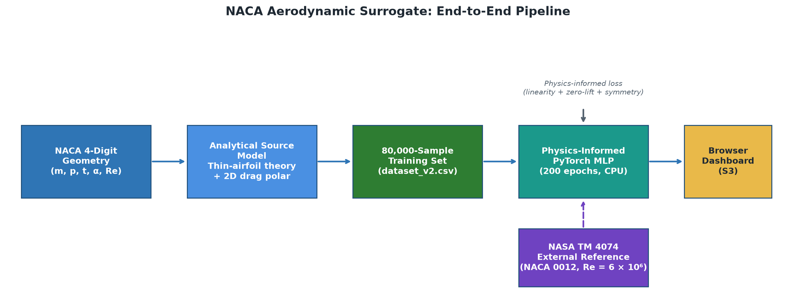
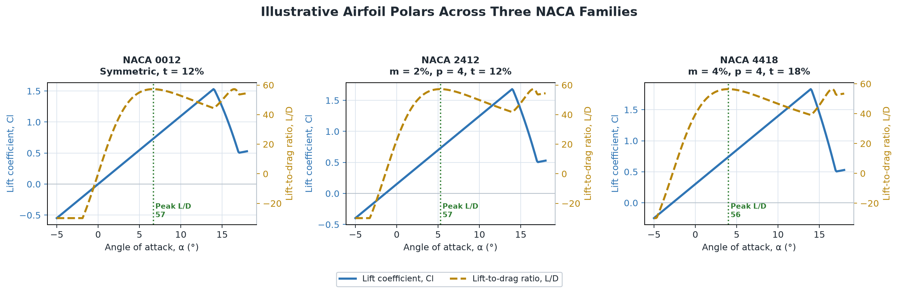
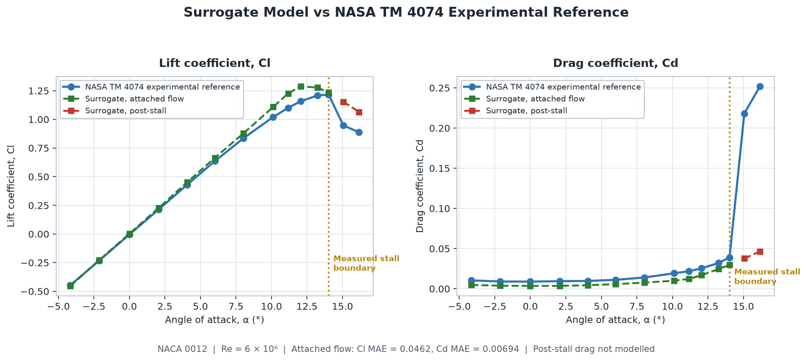
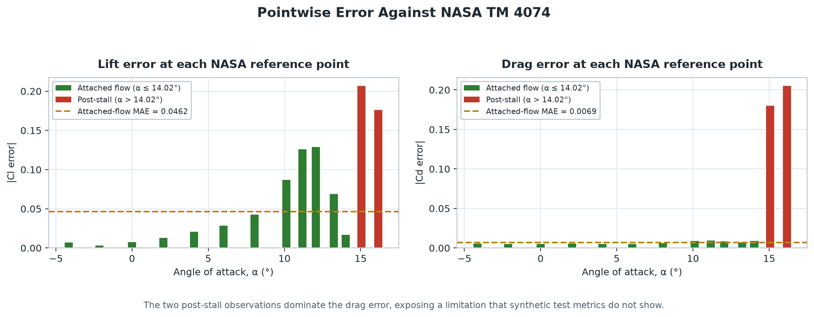

# NACA 4-Digit Aerodynamic Surrogate

**Author: Gagandeep Kapoor** | Mechanical Engineering | Amazon Intern (2026)

**A physics-informed neural-network surrogate for rapid 2D NACA 4-digit airfoil performance prediction — trained on CPU, deployed in the browser, validated against a NASA wind-tunnel reference.**

> **Scope:** this is a semi-empirical 2D section surrogate for design exploration, not CFD. Its strongest use is rapid interpolation within the analytical source-model domain (attached, incompressible flow). The external-reference results are reported separately from synthetic test metrics.

---

## Live Demo

Download `dashboard/index.html` and open it locally in any browser — no server required. The MLP forward pass runs client-side, so local execution is needed for full performance. Adjust camber, thickness, angle of attack, and Reynolds number interactively.

---

## What Makes This Different

Most ML regression projects stop at a high R² on a random split. This one doesn't.

- The source model is grounded in thin-airfoil theory — defect frequencies for bearings are to vibration what `Cl = 2π(α − α₀)` is to aerodynamics: a physics-derived prior, not a tuned constant
- Physics-informed constraints (linearity, zero-lift, symmetry) are baked into training loss, not added as post-hoc regularisation
- A global thickness multiplier was tested, produced better synthetic metrics, but was **rejected** because it worsened lift error against a real NASA wind-tunnel polar by 2×
- Calibration scope is explicitly bounded: the drag calibration covers one airfoil, one Reynolds number, and one surface condition — it is not applied globally
- The model runs entirely in vanilla JavaScript with no ONNX, no server, and no framework dependency — weights are exported as JSON and the forward pass is a hand-written matrix multiplication loop

---

## Pipeline

<p align="center">
  
</p>

```text
NACA geometry (m, p, t, α, Re)
           ↓
   Analytical source model
   (thin-airfoil theory + 2D drag polar)
           ↓
   80,000-sample training set
           ↓
   Physics-informed PyTorch MLP   ← physics loss (linearity + zero-lift + symmetry)
           ↓
   JSON weight export
           ↓
   Browser-side inference → S3 static dashboard
```

---

## Model

**Architecture**

```text
Input(5) → Dense(128, ReLU) → Dense(128, ReLU) → Dense(64, ReLU) → Output(2)
```

25,666 trainable parameters. `L/D` is derived as `Cl / Cd`, not predicted independently.

| Input | Symbol | Training domain |
|---|---:|---:|
| Maximum camber | `m` | 0–9% chord |
| Maximum-camber location | `p` | 0–9 tenths of chord (`p=0` for symmetric sections) |
| Maximum thickness | `t` | 6–24% chord |
| Angle of attack | `α` | −10° to +20° |
| Reynolds number | `Re` | 1×10⁵ to 1×10⁷ |

**Physics-informed loss**

```text
L_total = L_data + λ_linear · L_linearity + λ_zero-lift · L_zero-lift + λ_symmetry · L_symmetry
```

- **Linear lift:** enforces `Cl = 2π(α − α₀)` in the small-angle regime. A global Glauert thickness multiplier was tested and rejected — it improved synthetic metrics but worsened NASA reference Cl MAE from 0.0462 to 0.0961.
- **Zero lift:** `Cl = 0` at the geometry-specific zero-lift angle.
- **Symmetry:** symmetric sections (`m = 0`) have `Cl = 0` at `α = 0`.

---

## Airfoil Polars

<p align="center">
  
</p>

The surrogate correctly captures how increasing camber shifts the zero-lift angle and alters peak L/D without changing the lift-curve slope — consistent with thin-airfoil theory.

---

## Results

### Synthetic test (held-out 15% split)

| Output | R² | MAE | RMSE |
|---|---:|---:|---:|
| `Cl` | 0.9998 | 0.00904 | 0.01234 |
| `Cd` | 0.9997 | 0.00023 | 0.00033 |

These figures show that the MLP interpolated its semi-empirical source model. They do not establish accuracy against real experiments.

### External reference: NASA TM 4074

<p align="center">
  
</p>

- **Source:** Ladson, *NASA Technical Memorandum 4074* (1988), Table VII
- **Condition:** NACA 0012, `Re = 6×10⁶`, `M = 0.15`, transition fixed with No. 60-W grit
- **Data:** `data/validation/naca0012_ladson_tm4074_re6e6.json`
- **Original report:** [NASA TM 4074](https://ntrs.nasa.gov/api/citations/19880019495/downloads/19880019495.pdf)

| Regime | Points | Cl MAE | Cd MAE | Interpretation |
|---|---:|---:|---:|---|
| Attached flow (α ≤ 14.02°) | 12 | 0.0462 | 0.00694 | Lift trend is reasonable; drag baseline remains low for this tripped condition |
| Post-stall (α > 14.02°) | 2 | 0.1918 | 0.193 | Not a valid separated-flow drag model |
| Overall | 14 | 0.0670 | 0.0335 | Dominated by the known post-stall limitation |

<p align="center">
  
</p>

The error breakdown shows what high synthetic R² hides: lift error grows toward stall, and the drag model is entirely blind to separated-flow drag rise. Both are expected and documented limitations.

### Bounded attached-flow drag calibration

A separate calibration fits the production drag-correlation form to the 12 attached-flow NASA points only. The two post-stall points are excluded.

| Calibration quantity | Result |
|---|---:|
| Attached-flow Cd MAE | 0.000701 |
| Attached-flow Cd RMSE | 0.000882 |
| Maximum absolute Cd error | 0.001738 |

This is a calibration residual, not held-out validation. The fitted constants are not applied globally because they represent one airfoil, one Reynolds number, and one fixed-transition surface condition.

---

## Dashboard

<p align="center">
  <em>Open <code>dashboard/index.html</code> in a browser to explore the interactive Cl/Cd polars, L/D heatmaps, design-space sweep, and NACA 0012 reference comparison.</em>
</p>

| Dashboard element | Data source | Status |
|---|---|---|
| `Cl`, `Cd`, `L/D`, polars, design-space heatmap | Trained MLP (JSON weights, browser forward pass) | Semi-empirical surrogate output |
| NACA 0012 reference overlay | NASA TM 4074 data | External reference/calibration case |
| NACA 2412 comparison | Approximate digitised points | Qualitative reference only |
| Flow field, streamlines, pressure heatmap, Cp | Kutta-Joukowski single-vortex model | Analytical illustration, not the neural network |

---

## Repository Structure

```text
github/
├── analysis/
│   ├── naca0012_tm4074_metrics.json            # regenerated external-reference metrics
│   ├── naca0012_tm4074_drag_calibration.json   # regenerated bounded calibration result
│   └── archive/
│       ├── README.md                            # archive index
│       ├── pre_glauert_v2/                      # original v2 artefacts
│       └── rejected_glauert_v3/                 # rejected global-thickness experiment
├── assets/                                     # README plots
│   ├── pipeline_diagram.png
│   ├── airfoil_polars.png
│   ├── nasa_comparison.png
│   └── error_breakdown.png
├── dashboard/
│   └── index.html                              # browser dashboard (Plotly CDN)
├── data/
│   ├── generate_dataset.py                     # 80k analytical source dataset
│   ├── calibrate_drag.py                       # bounded NASA reference calibration
│   ├── uiuc_loader.py                          # approximate/reference polar loader
│   └── validation/
│       └── naca0012_ladson_tm4074_re6e6.json  # provenance-pinned NASA polar
├── model/
│   └── model_weights.json                      # browser inference weights (JSON)
├── scripts/
│   └── archive_rejected_glauert_run.sh
├── src/
│   ├── airfoil_geometry.py
│   ├── thin_airfoil_theory.py
│   ├── drag_model.py
│   ├── model.py
│   ├── physics_loss.py
│   ├── train.py
│   ├── export_weights.py
│   └── evaluate_reference.py
└── tests/
```

---

## Reproduce the Selected Baseline

Python 3.12+ and CPU PyTorch.

```bash
python3 -m venv .venv && source .venv/bin/activate
pip install torch --index-url https://download.pytorch.org/whl/cpu --no-cache-dir
pip install numpy pandas scipy matplotlib seaborn pytest --no-cache-dir

python3 tests/test_geometry.py
python3 tests/test_physics.py

python3 -m data.generate_dataset --out data/dataset_v2.csv
python3 -m src.train --data data/dataset_v2.csv --epochs 200
python3 -m src.export_weights \
  --model model/surrogate_model.pt \
  --output model/model_weights.json \
  --embed dashboard/index.html

python3 -m src.evaluate_reference
python3 -m data.calibrate_drag
```

Trained on AWS EC2 (t3.micro CPU, Ubuntu 26.04, ~8 min for 200 epochs). `export_weights.py` embeds the weights directly into `dashboard/index.html` so no local server is needed.

---

## Technologies

| Area | Tools |
|---|---|
| ML | PyTorch, NumPy, Pandas |
| Optimisation | SciPy bounded least squares |
| Physics | NACA 4-digit geometry, thin-airfoil theory, 2D profile-drag correlation |
| Evaluation | NASA TM 4074 reference polar, reproducible metrics scripts |
| Dashboard | HTML, CSS, Plotly, vanilla JavaScript MLP forward pass |
| Infrastructure | AWS EC2 CPU training, Amazon S3 static hosting |

---

## Key Technical Decisions

| Decision | Rationale |
|---|---|
| Classical `Cl = 2π(α − α₀)` source slope | Tested Glauert thickness multiplier; rejected after it worsened NASA Cl MAE by 2× despite better synthetic metrics |
| Physics loss (linearity + zero-lift + symmetry) | Encodes known aerodynamic behaviour directly into training; not post-hoc |
| Drag calibration bounded to attached flow only | Post-stall separated-flow drag is a different physics regime — extrapolating would be misleading |
| JSON weights + vanilla JS forward pass | Zero framework dependency at runtime; works on any static host or local browser open |
| 80,000 samples | Dense enough to cover the 5D input space (m, p, t, α, Re) at low model cost |

---

## Limitations

- Post-stall drag is not captured — the empirical drag model breaks down after flow separation
- Source model is semi-empirical 2D, not CFD; real airfoils also have 3D effects, surface roughness, and compressibility
- External reference covers one airfoil (NACA 0012) at one Reynolds number — not a systematic validation across the training domain
- Dashboard flow-field visualisation uses Kutta-Joukowski, not the neural network output

---

## Author

**Gagandeep Kapoor**
Mechanical Engineering Student | Amazon Intern (EMA4, 2026)

This project was designed, built, and validated entirely by Gagandeep Kapoor as a personal portfolio project, developed alongside an Amazon internship and AWS ML Engineer Associate certification. All physics derivations, model architecture choices, and design decisions — including the documented rejection of the Glauert experiment — are original work.
